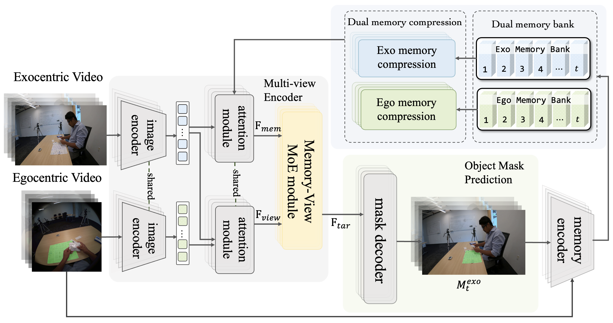

# Robust Ego-Exo Correspondence with Long-Term Memory

[](https://neurips.cc/)
[](https://github.com/juneyeeHu/LM-EEC)

## Overview


This repository hosts the official code for our work:

**"Robust Ego-Exo Correspondence with Long-Term Memory"**

Establishing object-level correspondences between **egocentric** and **exocentric** views is crucial for AI assistants to provide precise and intuitive visual guidance. However, this task is challenging due to extreme viewpoint variations, occlusions, and the presence of numerous small objects. Existing methods, often adapted from video object segmentation approaches such as XSegTx and XView-XMem, struggle to handle these challenges effectively.

Recently, the Segment Anything Model 2 (SAM 2) has demonstrated strong generalization capabilities and impressive performance in video object segmentation. Nevertheless, directly applying SAM 2 to the ego-exo correspondence (EEC) task encounters key limitations, including suboptimal feature fusion across views and inefficient memory management for long video sequences.

To address these issues, we propose a novel EEC framework based on SAM 2 with **long-term memories**, introducing a **dual-memory system** and an **adaptive feature routing module inspired by Mixture-of-Experts (MoE)**. Specifically, our approach features:

1. a **Memory-View Mixture-of-Experts module** which consists of a dual-branch routing mechanism to adaptively assign contribution weights to each expert feature along both channel and spatial dimensions.  
2. a **dual-memory bank system** with a dedicated **compression strategy** to retain critical long-term information while eliminating redundancy. 

Extensive experiments on the challenging **EgoExo4D benchmark** demonstrate that our method, dubbed **LM-EEC**, establishes new state-of-the-art performance, significantly outperforming existing approaches and the SAM 2 baseline, and exhibiting strong generalization across diverse scenarios.

## Latest updates
**2025.12.02 — We publicly release the official implementation of our LM-EEC model.**

**2025.09.18 — Our paper has been accepted to NeurIPS 2025!**


## Getting Started

### Environment Setup
Install the packages required for training by running 
```bash
pip install -e ".[dev]".
```

### Dataset preparation
You may follow [EgoExo4D](https://github.com/EGO4D/ego-exo4d-relation/tree/main/correspondence) to download the original dataset and pre-process the data for each train, val and test splits. 
Or directly use our [processed dataset](https://huggingface.co/datasets/hhyyjj/egoexo).

### Training LM-EEC
#### 1. Download SAM 2.1 Checkpoint
LM-EEC is built on top of SAM 2.1-base-plus, so you should download the checkpoint [sam2.1_hiera_base_plus.pt](https://dl.fbaipublicfiles.com/segment_anything_2/092824/sam2.1_hiera_base_plus.pt) and place it inside the checkpoints directory: ./checkpoint/.
#### 2. Configure Training
Then modify some configurations in the file ./sam2/configs/sam2.1_training/sam2.1_hiera_b+_EgoExo_finetune.yaml:

**(1)** Set training dataset path (line 16):
```bash
dataset:
  # PATHS to Dataset
  img_folder: /data/seg/EgoExo4D/train # PATH to EgoExo4D Images folder
```
**(2)** Set checkpoint saving directory and pretrained SAM 2.1 path (line 311 & 321):
```bash
checkpoint:
  save_dir: /data2/seg/LM-EEC/training/checkpoints_EgoExo
  save_freq: 0 
  model_weight_initializer:
    _partial_: True
    _target_: training.utils.checkpoint_utils.load_state_dict_into_model
    strict: True
    ignore_unexpected_keys: null
    ignore_missing_keys: ['MV_MoE.mlp1.0.weight', 'MV_MoE.mlp1.0.bias', 'MV_MoE.mlp1.2.weight', 'MV_MoE.mlp1.2.bias', 'MV_MoE.mlp2.0.weight', 'MV_MoE.mlp2.0.bias', 'MV_MoE.mlp2.2.weight', 'MV_MoE.mlp2.2.bias', 'MV_MoE.conv1.0.weight', 'MV_MoE.conv1.2.weight', 'MV_MoE.conv2.0.weight', 'MV_MoE.conv2.2.weight']
    state_dict:
      _target_: training.utils.checkpoint_utils.load_checkpoint_and_apply_kernels
      checkpoint_path: /data/seg/LM-EEC/checkpoints/sam2.1_hiera_base_plus.pt # PATH to SAM 2.1 checkpoint
      ckpt_state_dict_keys: ['model']
```
Finally, you could enter in the training folder and directly run the train.py.

### Inference

To evaluate on the validation or test split:
```bash
python ./tools/correspondence_inference.py \
  --sam2_checkpoint /data/seg/LM-EEC/checkpoints_EgoExo/checkpoint.pt \
  --base_video_dir /data/seg/EgoExo4D/val \
  --output_mask_dir /data/seg/LM-EEC/egoexo_val \
  --swap False
```
You may either use your own trained model or evaluate LM-EEC directly with our pre-trained checkpoints available [here](https://drive.google.com/drive/folders/1tc5HNWl0j7BcJE4uX0Bzb6PiYdlIWvXx?usp=sharing).
### Evaluation
After inference, follow the [EgoExo4D](https://github.com/EGO4D/ego-exo4d-relation/tree/main/correspondence/evaluation) evaluation pipeline:
#### 1. Merge Predictions
```bash
python ./evaluation/merge_pred.py \
  --input /data/seg/LM-EEC/egoexo_val \
  --gt /data/seg/EgoExo4D/relations_val.json \
  --pred /data/seg/LM-EEC/egoexo_val
```
```bash
python ./evaluation/merge_results.py \
  --input_dir /data2/seg/EgoExo4D \
  --split val \
  --pred_dir /data/seg/LM-EEC/egoexo_val \
  --swap False \
  --json_path /data/seg/LM-EEC/egoexo_val_results.json
```
#### 2. Compute Metrics
Then we could run the compute_metrics.py to get all the metrics of the model:
```bash
python ./evaluation/compute_metrics.py \
  --gt-file /data/seg/EgoExo4D/gt_final_results_val.json \
  --pred-file /data/seg/LM-EEC/egoexo_val_results.json
```

# Citation
Please consider citing the paper if you find it useful:
```bash
@article{hu2025robust,
  title={Robust Ego-Exo Correspondence with Long-Term Memory},
  author={Hu, Yijun and Fan, Bing and Gu, Xin and Ren, Haiqing and Liu, Dongfang and Fan, Heng and Zhang, Libo},
  journal={arXiv preprint arXiv:2510.11417},
  year={2025}
}
```

# Reference
The code is mainly based on [SAM 2](https://github.com/facebookresearch/sam2), thanks for their wonderful work!

